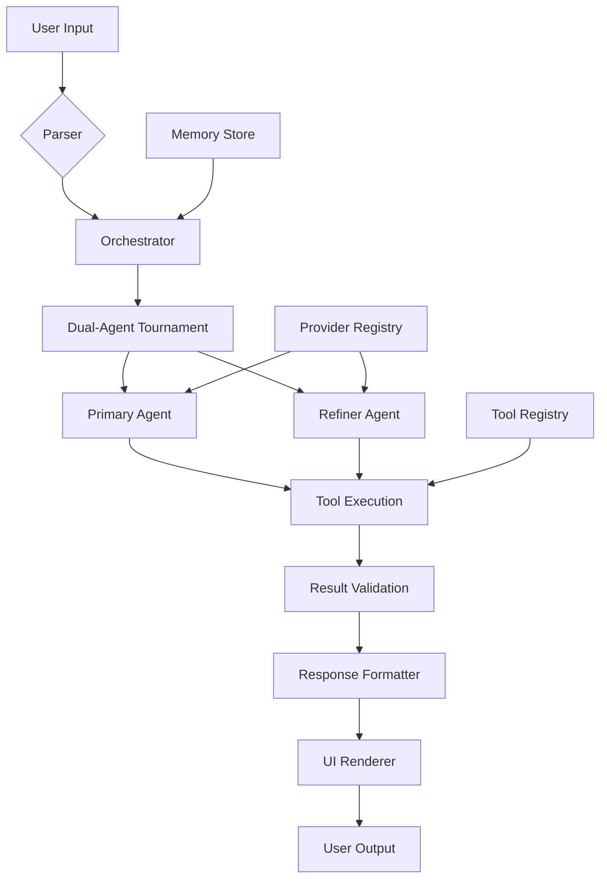

# first of all, you want to maintain a core set of source code, then leave everything else to temp, repo specific, or genai including tools generation and compilation for new tools and upgraded tools on the fly

This repo DOES NOT DO THIS CORRECTLY AT ALL

# So the NSA etc. can't really use Claude Code or Codex CLI, or even the very broken Gemini CLI, because they can't control the data flow

This CLI solves this problem, and well you figure out how to change the dist terminal command (from agi to whatever) and then develop your own CLI. I'm not allowed to do NSA work and the source code is so little here with full power that creating Stuxnet with this would have taken only 5 minutes.

# Hint

Change the sys prompt and guardrails to allow for anything at all

# FYI

Currently I'm using deeepseek-reasoner with xai 4-1-fast-reasoning auto fallback cuz I happen to have API purchase credits on those platforms, but you can use any provider or even local LLM via running open weights

# I'm not developing this beyond this point, and may perioditicly update if that

I'm doing my own thing

# 🚀 AGI Core - Elite AI Agent Framework

<div align="center">

**AGI Core** is a premium AI agent framework with multi-provider support, advanced orchestration, and offensive security tooling.


</div>

## 🎯 **What is AGI Core?**

AGI Core is an advanced AI coding assistant that goes beyond simple chat. It's a **production-ready framework** that can:

- **🧠 Understand your codebase** and make intelligent edits
- **🔧 Execute tools autonomously** (edit files, run commands, search web)
- **🏆 Run True AlphaZero self-play** (two agents compete with worktrees, build/test/security scoring, winner reinforcement)
- **🛡️ Perform security scanning** (authorized red-teaming with TAO Suite)
- **📚 Learn from past work** (episodic memory system)
- **⚡ Parallelize operations** for faster task completion

## ✨ Features

### 🎨 **Premium UI/UX**
- Modern terminal interface with neon gradients and animations
- Real-time status indicators and progress visualization
- Responsive design with adaptive layouts
- Syntax highlighting and code formatting

### ⚡ **Core Capabilities**
- Multi-provider AI support (OpenAI, Anthropic, Google, DeepSeek, xAI)
- Autonomous tool execution with safety validation
- Parallel task execution and orchestration
- True AlphaZero self-play: two agents with isolated worktrees compete, scored by build/test/security gates, with winner reinforcement
- Episodic memory and context management

### 🛠️ **Advanced Tooling**
- **TAO Suite**: Offensive security tools for authorized red-teaming
- **KineticOps**: Advanced system manipulation and automation
- **Enhanced Git**: Multi-worktree management and advanced workflows
- **Web Tools**: Advanced web search and content extraction
- **Bash Tools**: Secure command execution with validation

### 🧠 **Intelligence Features**
- Real-time reasoning and hypothesis engine
- **Dynamic Guardrails**: Adaptive safety controls that evolve with AI capabilities
- **AI System Updater**: Comprehensive update framework with rollback capabilities
- Hallucination guard and validation systems
- Task completion detection with confidence scoring
- Automated bug analysis and fix generation

## 🚀 Quick Start

```bash
# Clone and install
git clone <repository>
cd agi-core-cli
npm install

# Build the project
npm run build

# Run the CLI
npm start
# or directly
agi
```

## 📦 Installation Options

### Global Installation
```bash
npm install -g erosolar-cli
```

### Local Development
```bash
npm install
npm run build
npm test  # Run test suite
```

## 🎯 Usage Examples

### Interactive Mode
```bash
agi
```

### Headless Mode
```bash
agi --eval "Analyze the current directory structure"
agi --json --provider openai --model gpt-4 --prompt "Explain quantum computing"
```

### Quick Mode
```bash
agi --quick "Fix the bug in main.ts"
```

## 🔧 Advanced Features

### True AlphaZero Self-Play
Run the competitive loop end-to-end:
```bash
/alphazero "Objective here" --max-iterations=4 --build="npm run build --if-present" --test="npm test -- --runInBand --passWithNoTests" --security="npm run --if-present lint -- --max-warnings=0"
```

What happens:
1. Two independent agents propose different solutions in isolated worktrees
2. Each applies real code edits
3. Build, test, and security checks score each agent
4. The winner’s approach reinforces the next round; the loser is discarded
5. Iterates until neither agent shows measurable improvement

### Offensive Security Mode
Authorized red-team operations:
```bash
agi
# Access TAO tools: portscan, dnsenum, exploit, persistence, c2
```

### Worktree Management
```bash
agi
# Use enhanced Git tools for multi-branch development
```

## 🏗️ Architecture



## 📚 Documentation

- **API Documentation**: See `/docs` for detailed guides
- **Security Controls**: Advanced permission and validation systems
- **Training Modules**: AI behavior and optimization guides
- **Operations Playbook**: Deployment and maintenance procedures

## 🔒 Security

- **Validation**: All commands validated before execution
- **Permissions**: Granular access control for offensive tools
- **Audit Logging**: Complete execution history tracking
- **Sandboxing**: Secure execution environment for risky operations

## 🤝 Contributing

We welcome contributions! Please see our contribution guidelines and code of conduct.

## 📄 License

MIT License - see LICENSE file for details.

---

<div align="center">

**Made with ❤️ by the AGI Core Team**

[](https://twitter.com/agilabs)
[](https://discord.gg/agi)
[](https://github.com/agilabs/agi-core-cli)

</div>
